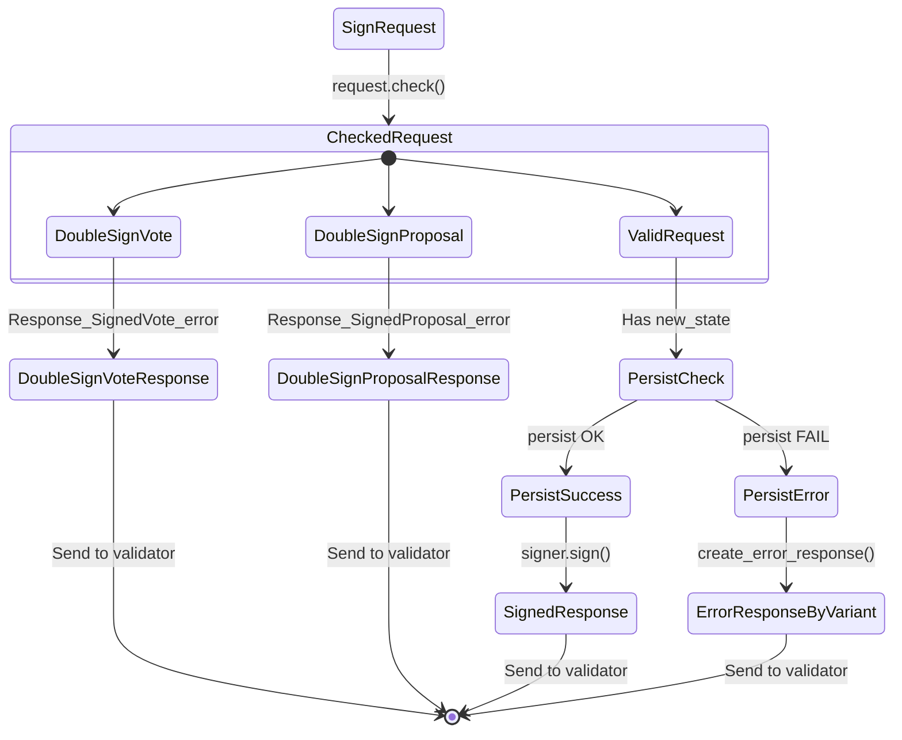
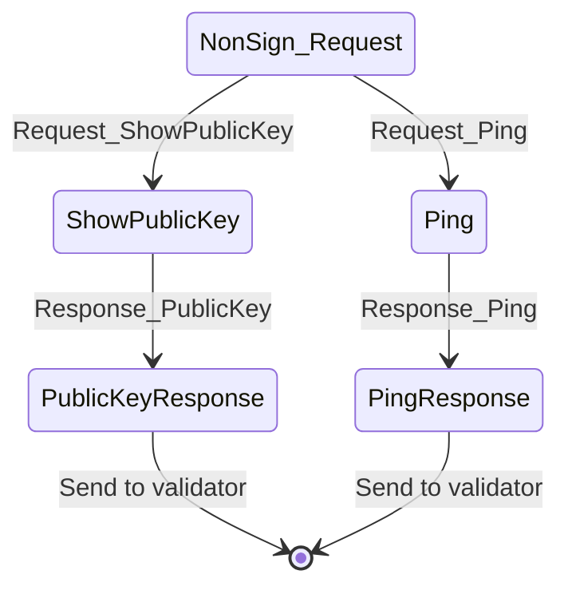

# Request Processing Flow

This document describes how Nebula processes incoming requests from CometBFT validators. 

## Overview

Nebula's buckets incoming requests into three categories:

- Sign requests (votes, proposals)
- Ping requests
- Pubkey requests

Ping and pubkey requests are not signed, they are for internal usage by the validator; because of this, a response is sent immediately without checks.

Signing requests need to be checked, as Nebula can receive a request for a block that's already been signed.

This document contains the state transitions for both types of requests (signable & non-signable)

### Signable Requests (Proposals & Votes)

### Non-Signable Requests

